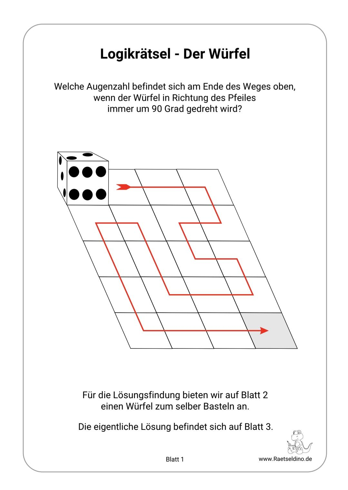

# cube-puzzle-solver

Ich habe folgendes Rätsel unter "raetseldino.de" gefunden:

Das Rätsel wollte ich schnell mit einem einfachen C-Programm lösen.

In den Variablen top, front und leftside gibt man den initialen Zustand des Würfels an.

Im Array ops gibt man nacheinander die Rotationsschritte des Würfels an.

Das Programm benötigt keine Eingabe. Das Array ops und die Variablen für den Zustand werden vor dem Kompilieren hardcoded eingefügt. (Nicht sehr toll, ging aber schneller so. ^^)